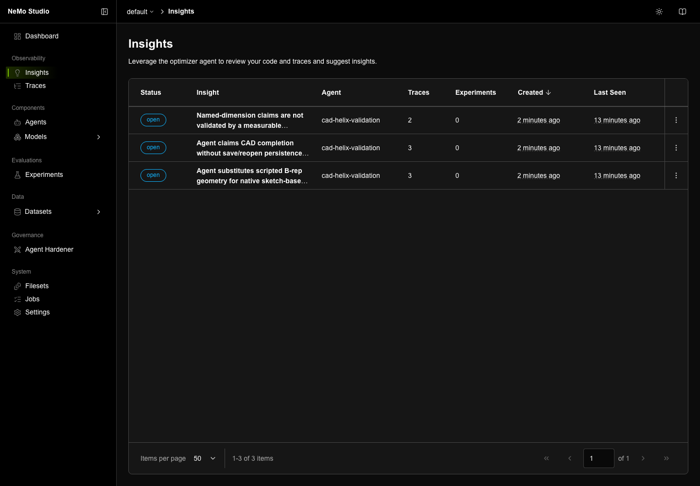

<!-- markdownlint-disable MD013 -->
<!-- SPDX-FileCopyrightText: Copyright (c) 2026 NVIDIA CORPORATION & AFFILIATES. All rights reserved. -->
<!-- SPDX-License-Identifier: Apache-2.0 -->
<!-- markdownlint-enable MD013 -->

# NeMo Helix Harness Optimization

| Catalog field | Value |
| --- | --- |
| Description | Reconstruct a parametric CAD model, measure geometric fidelity, and analyze Helix traces to guide harness improvements. Eval Author and automated candidate generation remain pending. |
| Industry | 🏭 Manufacturing |
| Requirements | macOS · Python 3.12 and 3.13 · FreeCAD 1.1 with freecad-mcp · NeMo Helix with Deep Agents and Intake · inference credentials |
| NemoClaw | N/A |
| Harness | LangChain Deep Agents 0.7.9 |
| OpenShell | N/A |

Use NeMo Helix to improve a specialized agent while keeping its task and scorer
fixed. The agent drives FreeCAD through MCP to reconstruct a mesh as an editable
PartDesign model. Helix collects its traces; the Analyst turns those traces into
findings that can guide changes to the system prompt, skills, or subagents.

The Helix workflow has been run live through CAD reconstruction, independent
scoring, trace collection, and both analysis paths. The baseline failed the
CAD quality criteria; successful execution is not a passing model. Eval Author integration and
the replacement for Experimentalist are pending. A local candidate-search
adapter now connects the implemented Helix study driver to CAD evaluation;
it searches explicitly authored candidates rather than generating them. [MIGRATION.md](MIGRATION.md) records source
revisions, completed work, validation, and the remaining handoffs.

## Screenshot



The live integrated Analyst filed three findings about native PartDesign
construction, dimension-driven regeneration, and unverified persistence. The
standalone Analyst produced four findings in a local YAML report. See the
[validation record](results/helix-validation.md) for the analysis configurations
and the baseline's actual CAD failures. Older measurements remain in
[results/](results/README.md).

## At A Glance

| Question | Answer |
| --- | --- |
| Category | Developer Tool |
| Contributor or provenance | NVIDIA |
| Use this when | A tool-using specialist agent needs measurable improvements to its instructions, skills, or subagents. |
| You will get | A CAD baseline, geometric scores, Helix traces, Analyst findings, and local candidate comparisons; Eval Author and automatic proposal generation are pending. |
| Runs on | macOS with FreeCAD GUI and the agent on the same host. |
| Requires | Python 3.12 and 3.13, uv, Git, FreeCAD 1.1 and freecad-mcp 0.1.24, Helix services including Intake, Deep Agents runtime, and a configured inference model. Docker is required for local Intake storage and the retained Harbor verifier. |
| Verified on | macOS 26.5.2, FreeCAD 1.1.3, Python 3.12.12, Helix source b6ff571, Fabric 0.3.0, Deep Agents 0.7.9; standalone Analyst on Python 3.13.12. |
| Evidence level | live execution, analysis, and local candidate search with independent CAD checks; Eval Author and automated proposals remain pending. |
| Support and maturity | In-progress migration; [best-effort community support](../../../SUPPORT.md). |
| External access, data, and actions | Installation downloads packages; live runs send prompts, geometry descriptions, traces and ethos to configured inference endpoints, write Helix telemetry, and modify FreeCAD documents. |
| Start here | [Setup](#setup) |
| Confirm success | [Verification](#verification) |

## Architecture

```text
agent/agent.yaml → Helix / Deep Agents → freecad-mcp → FreeCAD
                          │                             │
                          ▼                             ▼
                      Helix Intake                scorer/score.py
                          │                         geometric IoU
                          ▼
               Analyst (labs-trace-intel)
                          │
                          ▼
                   evidenced findings
                          │
                pending: Eval Author
                          │
             pending: propose → evaluate → review
```

Helix supplies lifecycle, inference, and trace storage. The Analyst is a separate
library with connectors for Intake, Langfuse, and other sources. Helix's Insights
plugin also depends on that library, so separation does not mean the Analyst
has disappeared from Helix. This example keeps **Helix Intake as the trace
source** for both the integrated and standalone analysis paths.

The scorer stays outside `agent/`, whose files are accessible to the agent.
IoU measures shape overlap; it does not prove a model is editable. The domain
requirements in [agent/ETHOS.md](agent/ETHOS.md) also require a valid solid, a
sketch-based feature tree, and named dimensions that actually drive geometry.
The ethos is input context here, not a claim about a future Eval Author schema.

## Setup

Use a disposable FreeCAD document and a model endpoint permitted to receive the
mesh descriptions and trace contents. Tool calls can execute Python inside
FreeCAD. Keep the XML-RPC listener on loopback; this example adds no sandbox.
Do not run two reconstructions concurrently against the same GUI session.

1. Install FreeCAD 1.1 and the [freecad-mcp addon](https://github.com/neka-nat/freecad-mcp).
   Enable its RPC service and launch the GUI normally. The agent's MCP client is
   pinned to `freecad-mcp==0.1.24`; the addon must be installed separately.
2. Install Helix from the inspected source revision. The advertised PyPI
   package `nemo-helix[all]` was unavailable during live validation, so use the
   source bootstrap. Its `uv.lock` pins the Python dependency graph. Install
   Git, a C compiler, npm, and Docker Desktop first; keep Docker running. These commands put the required build tools
   in temporary directories without replacing your existing `nemo`:

   ```bash
   cd examples/tools/nemo-helix-harness-optimization
   export CAD_EXAMPLE_ROOT="$PWD"
   export HELIX_SOURCE=/tmp/nemo-helix-cad
   uv venv --python 3.13 /tmp/helix-build-tools
   uv pip install --python /tmp/helix-build-tools/bin/python uv==0.12.18
   npm install --prefix /tmp/helix-node node@22.23.2 pnpm@10.34.5
   export PATH="/tmp/helix-build-tools/bin:/tmp/helix-node/node_modules/.bin:$PATH"
   git clone https://github.com/NVIDIA-NeMo/nemo-helix.git "$HELIX_SOURCE"
   cd "$HELIX_SOURCE"
   git checkout b6ff571721eadd2b85c939c9c8e3405ab9b3ae44
   make TOOLCHAIN=system bootstrap-python
   make TOOLCHAIN=system bootstrap-studio
   source .venv/bin/activate
   nemo --version
   ```

   Choose an empty checkout directory. Keep that checkout and its environment
   while using Helix; use a persistent location instead of `/tmp` for ongoing
   work. The source bootstrap uses Python 3.12 and installs the Deep Agents and
   Insights plugins. The separate Analyst below uses Python 3.13.

   **Activate the environment in every services terminal.** Invoking the venv's
   `nemo` by absolute path alone is insufficient: Fabric uses `VIRTUAL_ENV` to
   find its adapter interpreter. A missing activation caused the real smoke
   test to fail with `No module named nemo_fabric_adapters`.

   For an isolated instance alongside an older installation, select fresh state
   and a separate port before setup or service startup:

   ```bash
   export NHX_DATA_DIR="$HOME/.local/share/nemo-helix-cad"
   export NHX_CONFIG_FILE="$HOME/.config/nhx/cad-example.yaml"
   export NHX_BASE_URL=http://127.0.0.1:9080
   export NHX_WORKSPACE=default
   mkdir -p "$(dirname "$NHX_CONFIG_FILE")"
   test -f "$NHX_CONFIG_FILE" || printf '{}\n' > "$NHX_CONFIG_FILE"
   export NEMO_AGENTS_GATEWAY_READ_TIMEOUT=1800
   nemo config set --base-url "$NHX_BASE_URL" --workspace "$NHX_WORKSPACE"
   nemo services run --host 127.0.0.1 --port 9080 --instance cad-example
   ```

   In a second terminal, activate the same environment and export the same
   `NHX_*` values. Run `nemo setup` to connect to that running instance and
   register your inference provider, then `cd "$CAD_EXAMPLE_ROOT"` (or return
   to this example's directory). Do not start the new instance with an old
   installation's data directory. Studio must be built before services start.
   See the [upstream setup guide](https://docs.nvidia.com/nemo-helix/documentation/get-started/setup/)
   for other installation options.
3. Configure the connection and find your model:

   ```bash
   export NHX_BASE_URL=http://127.0.0.1:9080
   export NHX_WORKSPACE=default
   nemo config set --base-url "$NHX_BASE_URL" --workspace "$NHX_WORKSPACE"
   nemo models list --all-pages
   command -v uvx
   ```

   Edit `agent/agent.yaml`: replace `REPLACE_WITH_YOUR_MODEL_NAME` with your
   discovered model entity and set the MCP executable to the absolute `uvx`
   path. The sample gateway and Intake URLs target `127.0.0.1:9080` and workspace
   `default`; change both if your instance differs. Mirror these settings in
   `harness/agent_source/agent.yaml` before any future Harbor trial.

The host subprocess must reach the FreeCAD GUI on that host. A remote Helix
worker cannot reach your laptop's loopback RPC service. Keep credentials in the
Helix setup or environment, never in agent YAML. [.env.example](.env.example)
lists the additional environment settings; copying it does not configure the
Helix CLI or load variables into your shell automatically.

## Step 1: Deploy the CAD agent

[agent/agent.yaml](agent/agent.yaml) keeps the Deep Agents harness, MCP tools,
and local workspace. Registration stages the agent directory; do not put the
scorer or private material there.

```bash
nemo agents create --name cad-agent --agent-config "$PWD/agent/agent.yaml"
nemo agents deploy --agent cad-agent --name cad-agent-deployment --mode subprocess
nemo agents invoke --agent-deployment cad-agent-deployment \
  --input "List the FreeCAD documents currently open."
```

Confirm the invocation lists the documents and its trace reaches Intake before
running the expensive reconstruction. Use `nemo agents logs cad-agent-deployment -f`
to investigate failures. Helix's deployment path supplies telemetry; direct
file invocation uses the explicit Intake exporter in the Harbor agent config.
See [observability](https://docs.nvidia.com/nemo-helix/documentation/agents/observe-agents/)
for the Intake service and Studio trace views.

## Step 2: Measure a baseline

The task in [instruction.md](harness/dataset/train/parametric-mug/instruction.md)
asks for a parametric reconstruction of [reference_mug.obj](meshes/reference_mug.obj).
The scorer compares the finished model against that mesh at 0.1 mm XY resolution.
Keep the task, model, mesh, and scorer fixed when comparing harness changes.

The following commands spend inference tokens and create three FreeCAD documents.
Confirm `EvalMug1`, `EvalMug2`, and `EvalMug3` do not already exist. Record the UTC
start and end of the run window for the Analyst query.

```bash
mkdir -p baseline-prompts
python3 - <<'PY'
from pathlib import Path
root = Path.cwd()
task = (root / 'harness/dataset/train/parametric-mug/instruction.md').read_text()
for i in range(1, 4):
    prompt = task.replace('@MESH_PATH@', str(root / 'meshes/reference_mug.obj'))
    prompt = prompt.replace('`EvalMug`', f'`EvalMug{i}`')
    (root / f'baseline-prompts/prompt-{i}.md').write_text(prompt)
PY
for i in 1 2 3; do
  nemo agents invoke --agent-deployment cad-agent-deployment \
    --timeout 1800 --input "$(cat baseline-prompts/prompt-$i.md)" || break
  python3 scorer/score.py "EvalMug$i" meshes/reference_mug.obj || break
done
```

Expect one numeric IoU per completed document, between 0 and 1. Also inspect
whether changing a named dimension changes the solid after recompute. An IoU
above 0.85 alone does not satisfy the task. The live Helix baseline scored **0.8436, 0.4911, and 0.2872**. All three
outputs were valid solids, but all used generic `PartDesign::Feature` objects
instead of native sketches. None passed the complete CAD task. Older scores
in `results/` remain historical measurements, not expected outputs.

If the client times out, inspect the deployment and FreeCAD before retrying:
the agent may still be working. Where supported by the installed Helix release,
set `NEMO_AGENTS_GATEWAY_READ_TIMEOUT=1800` in the services environment before
starting services; the invocation timeout alone cannot extend a gateway timeout.

## Step 3: Analyze Helix traces

Analysis sends trace contents and the ethos to the selected inference endpoint.
Choose one of these paths; they have different output destinations.

### Helix-integrated Analyst

The current Insights plugin submits analysis as a job and stores findings in
Helix. It requires Jobs, an `agents.execute` runtime, and configured default and
fast models from `nemo setup`.

```bash
nemo insights analysis-runs create --agent cad-agent --workspace default \
  --ethos agent/ETHOS.md \
  --default-model "default/<your-model>" --fast-model "default/<your-model>" --wait
```

Replace both model placeholders with your configured tool-calling model. The
validation used the stronger model for both stages to obtain the published
Insights; a separate run with a faster evidence model returned no findings.
A zero-finding report does not certify the agent against the ethos.

Inspect the returned analysis run using
`nemo insights analysis-runs get <run-name> --workspace default`. Review its
report and any Insight trace references in Studio. A completed run may produce
zero findings. This path is documented by the
[upstream Analyst instructions](https://github.com/NVIDIA-NeMo/nemo-helix/blob/b6ff571721eadd2b85c939c9c8e3405ab9b3ae44/plugins/nemo-insights/src/nemo_insights_plugin/skills/nemo-analyst/SKILL.md).

### Standalone Analyst library with the Intake connector

Use this path to make the library boundary explicit. It reads the same Helix
traces but writes a local YAML report; it does **not** publish Insights to Studio.
Install it in its own tool environment to avoid mixing Helix's pinned Analyst
dependency with a newer standalone revision:

```bash
uv tool install --python 3.13 \
  'insight-agent @ git+https://github.com/NVIDIA-NeMo/labs-trace-intel.git@3a06bce1298190cd143a96880d6999052086632d'
cp analyst.yaml analyst.local.yaml
```

Edit `analyst.local.yaml` with the Intake URL, workspace, and timezone-aware UTC
bounds covering your baseline runs. Both bounds are required. They are explicit
config values, not inferred from `NHX_BASE_URL`. Set the inference credentials
from `.env.example`, using a tool-calling model that supports structured output.
For authenticated Intake, the connector currently uses the compatibility name
`NMP_ACCESS_TOKEN`; this is separate from the inference key.

```bash
insight-agent --config analyst.local.yaml
```

Read `insights.yml` and verify the evidence refers to the CAD runs you selected.
No findings is a possible successful outcome. The config supplies the local
ethos and disables sentiment analysis, which otherwise needs a separate
embedding model. See the [Intake connector guide](https://github.com/NVIDIA-NeMo/labs-trace-intel/blob/3a06bce1298190cd143a96880d6999052086632d/docs/sources/intake.md).

## Step 4: Evaluation authoring and candidate changes — pending

Keep each finding with its supporting trace IDs and the unchanged CAD task.
Eval Author's repository and API have not been supplied for this migration.
Do not invoke a removed command or assume the retained ethos and Harbor template
already match that API. The next integration needs to turn a finding into a
frozen behavioral test while retaining geometric IoU as an independent check.

The old Experimentalist is not the current Helix optimizer. The
[current optimizer guide](https://docs.nvidia.com/nemo-helix/documentation/agents/optimize-agents/run-the-agent-optimizer/)
describes suggestion workflows, skill optimization, and Fabric-backed tuning.
Those do not establish compatibility with this GUI-bound CAD evaluation. The
proposed replacement skill has not been supplied. The separate
[candidate-search integration](optimization/README.md) provides a usable local
alternative without waiting for that authoring workflow.

For the original Eval Author workflow, the remaining handoff is:

1. Integrate and validate Eval Author against one finding and its traces.
2. Freeze its suite and measure the unchanged baseline repeatedly.
3. Let the replacement propose changes only to system instructions, skills,
   and subagents in copies of `harness/agent_source/`.
4. Check each candidate with `scorer/verify_candidates.py`, then run serial
   trials and compare both authored metrics and independent IoU before promotion.

The retained Harbor wrapper, task template, train task, and validation task are
integration scaffolding for the future authoring loop. Their helpers have local
tests, and a full serial Harbor trial passed on Helix (invocation, Intake
retrieval, scoring, conversion, and Docker verification). The validation task uses the same mesh with a new
document name, so it measures repeatability, not generalization to other parts.
The archived profiles in `results/legacy-config/` are historical text, not active
Helix configuration. Do not promote the shipped historical candidates without
rechecking them on the current baseline.

## Candidate optimization

The [local optimization adapter](optimization/README.md) connects Helix’s
Optuna study driver to the existing CAD scorer and independent native-feature
checks. It compares system-prompt, skill, and sub-agent candidates serially.
This is a custom evaluator integration using the existing study driver, not
the stock `optimize-skills` command or the unimplemented genetic prompt backend.

## Verification

For local checks, no credentials, running services, or FreeCAD are required:

```bash
uv venv --python 3.13 .venv-checks
uv pip install --python .venv-checks/bin/python -r requirements.txt
.venv-checks/bin/python -m unittest discover -s tests
```

**Expected result:** all tests pass, with no dependency-related skips. These
checks cover scorer arithmetic, trace conversion, candidate boundaries, export
behavior, and Helix environment selection. They do not verify deployment,
telemetry delivery, Analyst inference, or future Eval Author integration.

To verify the live path, complete Steps 1–3 and retain sanitized evidence of a
successful invocation, scored geometry, matching Intake traces, and a completed
analysis report. Record exact installed versions and distinguish integrated
Insights from standalone YAML output. The live run completed these checks. See [the validation record](results/helix-validation.md)
for exact versions, scores, analysis outcomes, and remaining limitations.

### Run the retained Harbor verifier

After the three baseline runs, you can exercise the existing geometric verifier
without Eval Author. This spends inference tokens, creates a new FreeCAD holdout
document, and starts a Docker verifier container. The wrapper scores and closes
only its generated task document. Confirm `EvalMugHoldout` is not already open.

Use the activated Helix source environment. First configure the model, gateway,
MCP executable, and telemetry endpoint in `harness/agent_source/agent.yaml` to
match the baseline. Set `NEMO_AGENTS_IGW_API_KEY` for direct file invocation;
on the auth-disabled loopback test instance a nonempty marker sufficed, while
an authenticated deployment requires its appropriate credential.

```bash
export NEMO_CLI="$(command -v nemo)"
PYTHONPATH="$PWD/harness/agent_source" harbor run \
  -p "$PWD/harness/dataset/validation" -a harbor_wrapper:WrappedAgent \
  -n 1 --jobs-dir "$PWD/results/runs/harbor" --job-name cad-holdout
```

Choose a fresh job name for each run. Inspect its `result.json` and the trial's
`verifier/reward.json`: require one completed trial, zero errors, and `eval_iou`
equal to the host score in `agent_result.metadata`. **Harbor can exit 0 even
when the verifier failed.** A reward below 0.85 still fails the geometric target;
writing a reward successfully only verifies that the measurement path works.

The live corrected trial emitted `{"eval_iou": 0.5705}`. All three verifier
entry points now set the default `TRACE_DIR=/app/traces`; the old optimizer
used to inject that setting, and its absence caused the first live trial to
produce no reward file.

## Cleanup and export

Use `nemo agents undeploy --help` and `nemo agents delete --help` from your
installed release to remove only `cad-agent-deployment` and `cad-agent` when
finished. This removes service resources; close the generated FreeCAD documents
separately after saving anything you want to keep. Do not stop shared Helix
services or delete shared traces as part of example cleanup.

The existing `export_agent.py` can export the YAML configuration for a standalone
Deep Agents runner, dcode project, or HTTP client:

```bash
python3 export_agent.py agent/agent.yaml --to /tmp/cad-export
```

The exported HTTP client uses `NHX_BASE_URL` and `NHX_WORKSPACE`; explicit
`--base-url` and `--workspace` arguments override them. It must target the same
Helix instance as the deployment.

Export translation is covered by local tests; running the exported agent still
requires its runtime dependencies, MCP access, and a working inference endpoint.
Exporting does not carry Helix telemetry or the analysis pipeline into dcode.
